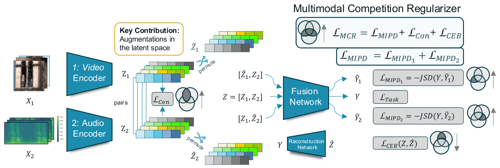
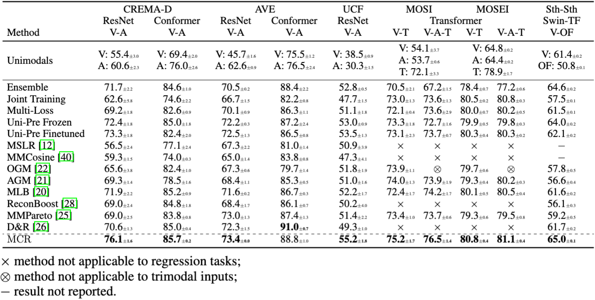
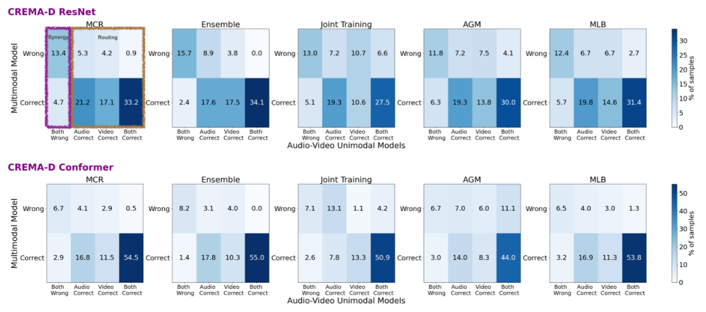

# Multimodal Competition Regularizer (MCR)

<div align="center">

Official implementation of the paper  

### **_Balancing Multimodal Training Through Game-Theoretic Regularization_**  
#### Accepted as a **_Spotlight at NeurIPS 2025_**

</div>

---

[](https://nips.cc/)
[](https://arxiv.org/abs/2411.07335)
[](LICENSE)

<div align="center">
  <strong>
    <a href="https://kkontras.github.io/">Konstantinos Kontras</a><sup>1</sup>,
    <a href="https://www.kuleuven.be/wieiswie/nl/person/00114748">Thomas Strypsteen</a><sup>1</sup>,
    <a href="https://www.kuleuven.be/wieiswie/nl/person/00126237">Christos Chatzichristos</a><sup>1</sup>,
    <a href="https://https://www.media.mit.edu/people/ppliang/overview//">Paul Pu Liang</a><sup>2</sup>,
    <a href="https://homes.esat.kuleuven.be/~mblaschk/">Matthew Blaschko</a><sup>1</sup>,
    <a href="https://www.kuleuven.be/wieiswie/nl/person/00050294">Maarten De Vos</a><sup>1,3</sup>
  </strong>
</div>
<div align="center">
  <sup>1</sup>Department of Electrical Engineering, KU Leuven, Leuven, Belgium <br>
  <sup>2</sup>Media Lab and EECS, MIT, Boston, USA <br>
  <sup>3</sup>Department of Development and Regeneration, KU Leuven, Leuven, Belgium
</div>


## TL;DR

Current multimodal training methods often fail because one data source (modality) dominates the learning process, hindering others. This paper introduces the Multimodal Competition Regularizer (MCR), a new method that measures the contribution of each modality and creates a game to balance them during training. By balancing each modality's contribution, MCR consistently outperforms previous methods on various real-world datasets.

---

## Method

MCR is a regularizer that addresses modality competition in multimodal learning. It uses a game-theoretic framework inspired by mutual information (MI) decomposition to balance modality contributions.

The total loss is composed of three key terms:
```math
L= L_{MIPD} + L_{Con} + L_{CEB}
```
- $L_{MIPD}$: Maximizes each modality's unique task-relevant information using efficient latent-space permutations.

- $L_{Con}$: Maximizes shared information by aligning representations with a supervised contrastive loss.

- $L_{CEB}$: Minimizes task-irrelevant shared information to reduce noise.

<div align="center">
  
</div>

A game-theoretic framework balances these contributions, where a hyperparameter 
k∈[−1,0,1] sets the strategy (Greedy, Independent, Collaborative).

```math
\nabla_{\theta_{1}}\mathcal{L}_{MIPD}=\lambda_{M}(\nabla_{\theta_{1}}\mathcal{L}_{MIPD_{1}}+k\nabla_{\theta_{1}}\mathcal{L}_{MIPD_{2}})
```


## Results

We evaluate **MCR** on six multimodal benchmarks, covering **emotion recognition**, **sentiment analysis**, **audio-visual event localization**, and **video action recognition**.  

### Main Results

<div align="center">
  
</div>

### Error Analysis

The bar plots below show how MCR affects error distribution on CREMA-D (ResNet and Conformer backbones).
Compared to baselines, MCR significantly reduces cases where only one modality is correct (e.g., video correct but audio wrong).  

<div align="center">
  
</div>

This analysis highlights that we should improve further the synergy of the framework, if you find that interesting join us!
## Repository Structure
```text
MCR/
│── agents/             
│   └── helpers/        # Evaluator, Loader, Trainer, Validator 
│── configs/            # Configuration files for each experiment + default configs
│── datasets/           # Datasets' loaders
│── experiments/        # Preprocessed trial data
│── figs/               # Figures & sample outputs
│── models/             # Model architectures
│── posthoc/            # Post-hoc Testing & Evaluation scripts
│── utils/              # Utility scripts
│── run.sh              # Shell script to launch training/testing (full or noisy)
│── train.py            # Training entry point
│── requirements.txt    # Dependencies
└── README.md           # You are here
```

---

Training can be initiated via the command line. For example:
```bash
python train.py --config ./configs/CREMA_D/res/MCR.json  --default_config ./configs/default_config.json --fold 0 --fold 0 --lr 0.0001 --wd 0.0001 --l 0.01 --multil 0.01 --num_samples 32 --reg_by greedy --batch_size 32 --contr_coeff 1 
```
You will find all the configurations used for each training in the `run.sh` file.

## Datasets

Our experiments evaluate MCR across diverse multimodal benchmarks.

| Dataset               | Modalities              | Task                                   | Link |
|------------------------|-------------------------|----------------------------------------|------|
| **CREMA-D**           | Video + Audio           | Emotion recognition                    | [CREMA-D](https://github.com/CheyneyComputerScience/CREMA-D) |
| **AVE**               | Video + Audio           | Action recognition        | [AVE](https://github.com/ysricuan/AVE-ECCV18) |
| **UCF**            | Video (+ Audio)         | Action recognition                     | [UCF](https://www.crcv.ucf.edu/data/UCF101.php) |
| **CMU-MOSI**          | Video + Audio + Text    | Sentiment analysis                     | [MOSI](https://github.com/A2Zadeh/CMU-MultimodalSDK) |
| **CMU-MOSEI**         | Video + Audio + Text    | Sentiment & emotion analysis           | [MOSEI](https://github.com/A2Zadeh/CMU-MultimodalSDK) |
| **Something-Something v2** | Video + Optical Flow    | Fine-grained action recognition        | [Sth-Sth](https://20bn.com/datasets/something-something) |


## Contact

For feedback, questions, or collaboration opportunities, feel free to reach out at [konstantinos.kontras@kuleuven.be](mailto:konstantinos.kontras@kuleuven.be).

We welcome pull requests, issues, and discussions on this repository.

##  Citation

If you find our work inspiring or use our codebase in your research, please consider giving a star ⭐ and a citation.
```markdown
@misc{kontras2024mcr,
      title={Multimodal Fusion Balancing Through Game-Theoretic Regularization}, 
      author={Konstantinos Kontras and Thomas Strypsteen and Christos Chatzichristos and Paul Pu Liang and Matthew Blaschko and Maarten De Vos},
      year={2024},
      eprint={2411.07335},
      archivePrefix={arXiv},
      primaryClass={cs.LG},
      url={https://arxiv.org/abs/2411.07335}, 
}
```